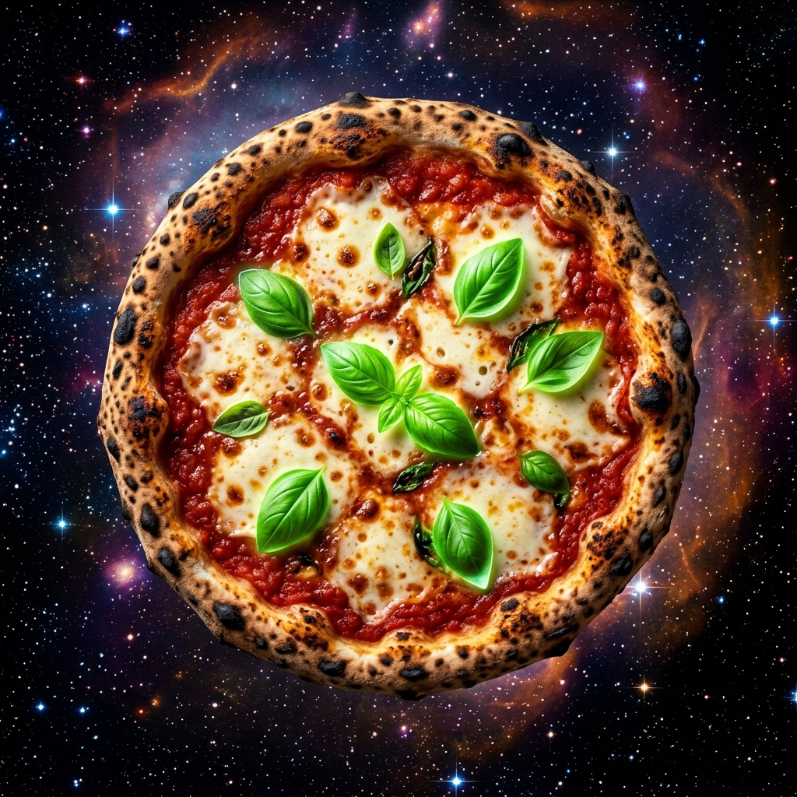
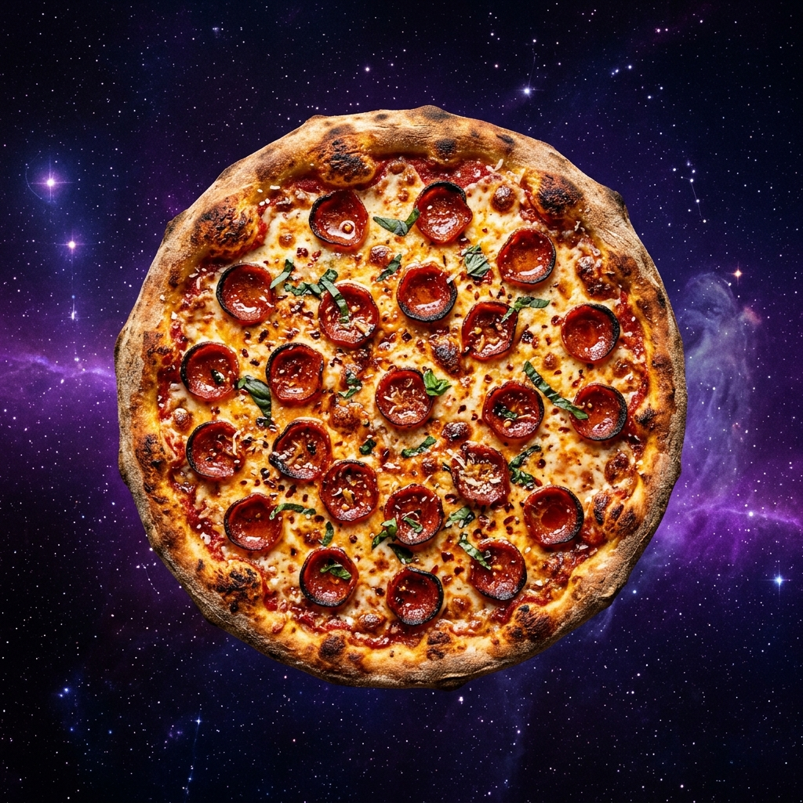
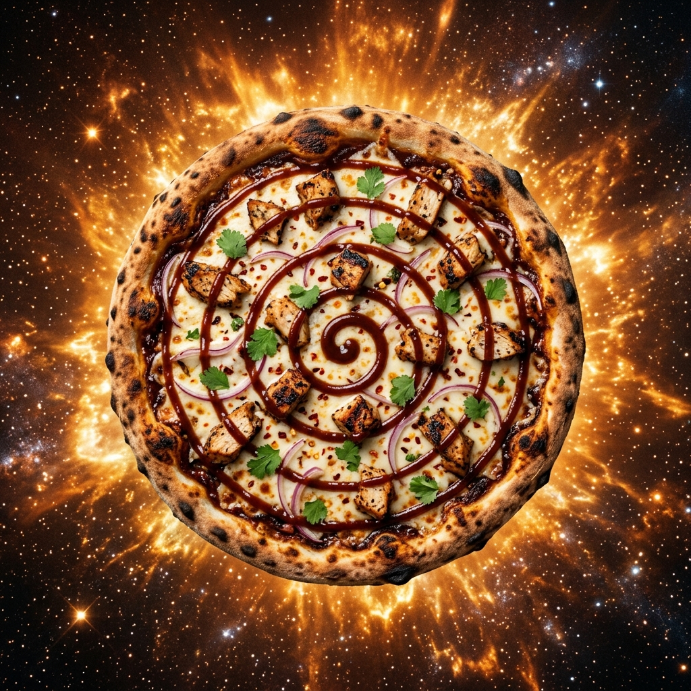
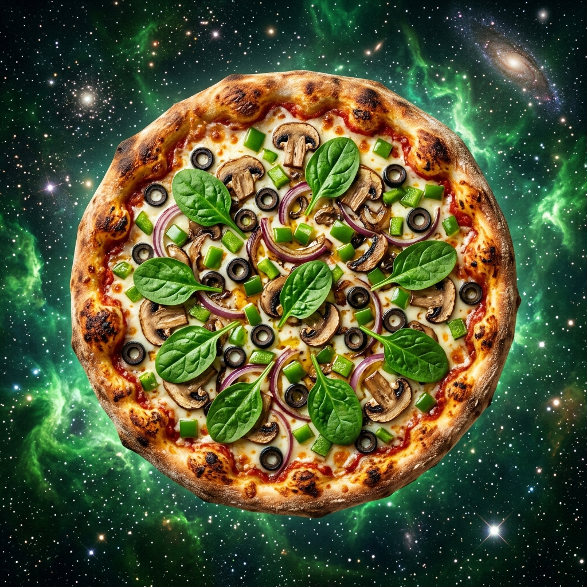

# 🍕 ChefPizza — Premium Artisanal Wood-Fired Pizza Shop

Welcome to **ChefPizza**, a premium, full-stack, and highly interactive web application designed for a modern artisanal pizza restaurant. Built from the ground up with a sleek glassmorphic dark-mode design, it features an custom 2D physics engine, delivery altitude-distance estimators, vector-animated branching radar tracking, and a secure Node.js Express backend integrating custom SMTP kitchen tickets.

---

## 🚀 Key Features

### 1. 2D circular Rigid-Body Canvas Physics (`index.html`)
* An interactive, gravity-based rigid-body physics playground on the homepage.
* Allows users to spawn, throw, and bounce high-quality ingredients, dough wheels, and pizza items.
* Built purely on **HTML5 Canvas** and custom vector-impulse mechanics without external libraries.

### 2. Dedicated Localized Menu (`menu.html`)
* Premium Pakistani wood-fired recipes represented in beautiful, harmonious HSL color cards.
* Features iconic flavors:
  * **Chicken Tikka Supreme** — *Rs. 1,399*
  * **Spicy Chicken Fajita** — *Rs. 1,499*
  * **Beef Bihari Kabab** — *Rs. 1,599*
  * **Achari Paneer Delight** — *Rs. 1,299*
* Linked to a unified **LocalStorage Cart System** that syncs item counts, pricing, and counts across all subpages.

### 3. Interactive Distance Delivery Calculator (`services.html`)
* Allows customers to adjust delivery ranges using a custom styled slider.
* Dynamically calculates tariffs (PKR) and estimated delivery times using native JavaScript bounding formulas.

### 4. Vector-Animated Delivery Radar Map (`location.html`)
* A stunning custom SVG flight radar with concentric glowing range rings, rotating sweep overlays, and coordinates telemetry.
* Clicking radar focal nodes instantly lock geographical coordinate data, estimated branches, and tracking readouts.

### 5. Secure Node.js SMTP Checkout Engine (`checkout.html`)
* Secure, multi-page order submission using a central `fetch()` checkout POST handler.
* All sensitive SMTP mail passwords and ports are hosted on the backend `.env` variables to prevent security exposures.
* Dispatches a highly detailed, beautifully styled HTML **Kitchen Ticket** to the shop owner's inbox (`pizza2@aistartups.me`) via standard STARTTLS `mail.aistartups.me:587`.
* Prompts the chef via email to **call the customer immediately on their provided phone number** to confirm orders. All WhatsApp links have been fully removed to preserve a clean, classic telephone confirmation process.

---

## 📸 Culinary Masterpieces (Our Pizzas)

Here are the artisanal creations served hot from our 900°F brick oven:

| Chicken Tikka Supreme | Nebula Pepperoni |
| :---: | :---: |
|  |  |
| **Supernova BBQ** | **Veggie Supreme** |
|  |  |

---

## 🛠️ Technology Stack

* **Frontend Structure & Logic**: HTML5, Vanilla JavaScript ES6 (Circular Physics, State Management, DOM Controllers).
* **Styling System**: Curated harmonious Vanilla CSS3 (Custom Google Fonts, HSL design tokens, Glassmorphism, Micro-interactions).
* **Backend Runtime**: Node.js, Express.js.
* **Mailing Relay Protocol**: Nodemailer (secured via backend Dotenv integration).
* **Package Management**: npm.

---

## ⚙️ Running Locally

Follow these quick steps to host ChefPizza on your machine:

1. **Clone your repository**:
   ```bash
   git clone https://github.com/andrewjason2/Pizza.git
   cd Pizza
   ```

2. **Install Dependencies**:
   ```bash
   npm install
   ```

3. **Configure Environment Variables**:
   Create a `.env` file in the root directory:
   ```env
   PORT=8999
   SMTP_HOST=mail.aistartups.me
   SMTP_PORT=587
   SMTP_USER=pizza2@aistartups.me
   SMTP_PASS=Narmi2589786
   RECEIVER_EMAIL=pizza2@aistartups.me
   ```

4. **Boot Up the Server**:
   ```bash
   node server.js
   ```

5. **Open in Browser**:
   Navigate to **[http://localhost:8999](http://localhost:8999)** and enjoy your piping hot wood-fired pizzas!
